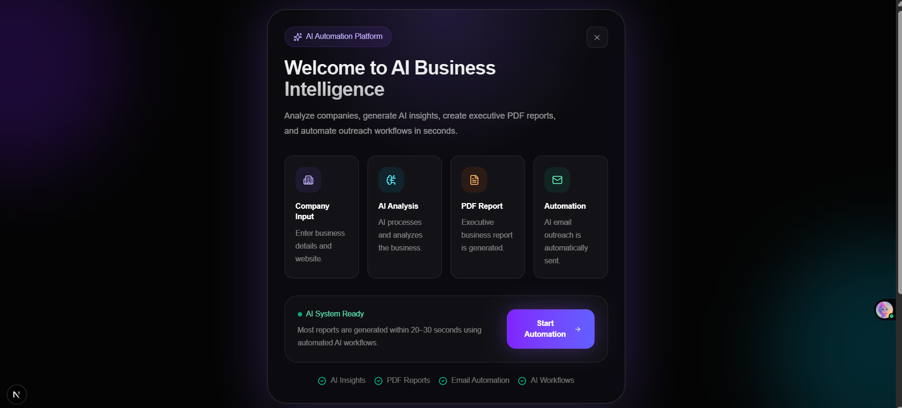
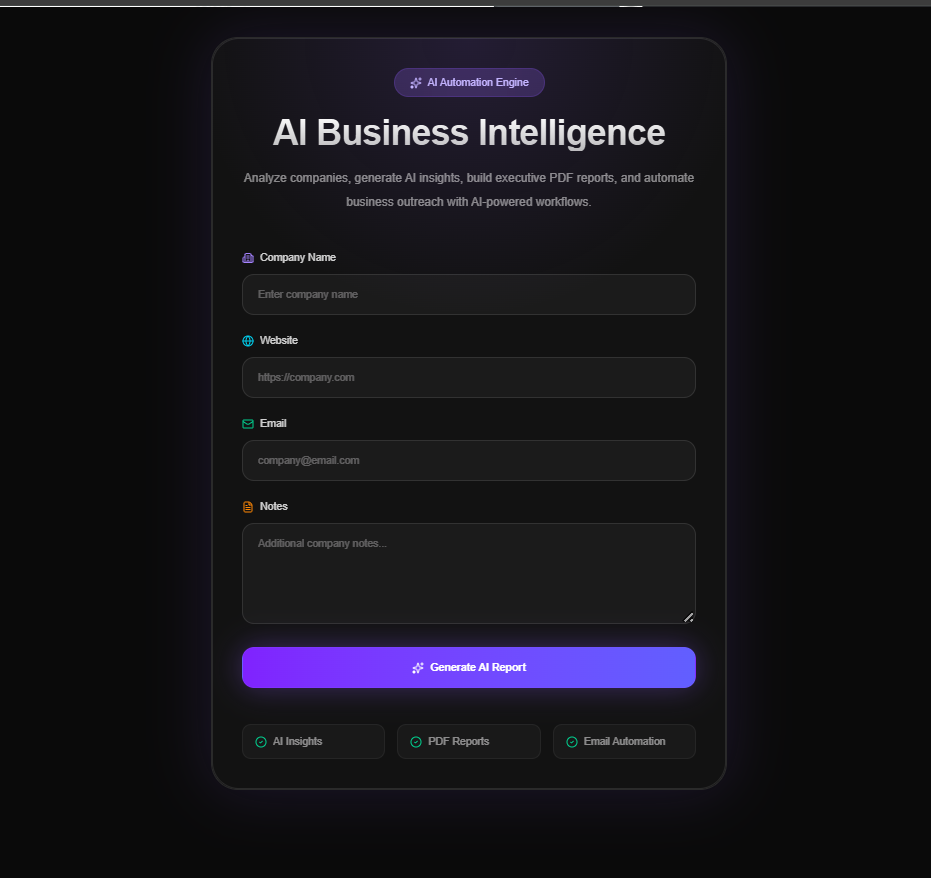
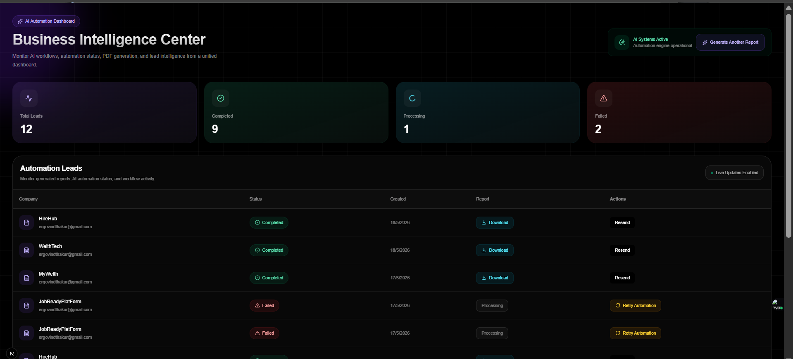

# AutoFlow — AI Business Intelligence & Automation Platform

AutoFlow is a modern AI-powered business intelligence platform that automates:

* Company analysis
* Website scraping
* AI insight generation
* Executive PDF report generation
* Automated email workflows
* Lead management dashboard

Built with a premium AI SaaS architecture using Next.js, Prisma, PostgreSQL, Tailwind CSS, and AI integrations.

---

# Features

## AI Automation Workflow

* Analyze company websites
* Generate AI-powered business insights
* Build executive PDF reports
* Send automated emails
* Retry failed workflows
* Resend completed reports

---

## Premium Dashboard

* AI operations dashboard
* Lead management system
* Real-time workflow status
* Retry automation controls
* Resend report controls
* Premium glassmorphism UI

---


# Application Preview

## AI Onboarding Experience

Premium first-time onboarding experience with AI workflow guidance.



---

## AI Automation Form

Generate AI-powered business intelligence reports with automated workflows.



---

## Business Intelligence Dashboard

Monitor AI workflows, retry failed automations, resend reports, and manage operational workflows from a premium AI dashboard.



---


## Modern Tech Stack

* Next.js 16 App Router
* React 19
* TypeScript
* Prisma ORM
* PostgreSQL
* Tailwind CSS v4
* Zod Validation
* React Hook Form
* AI Integration with Groq
* PDF Generation
* Email Automation

---

# Tech Stack

| Technology          | Purpose                   |
| ------------------- | ------------------------- |
| Next.js             | Fullstack React Framework |
| React 19            | Frontend UI               |
| TypeScript          | Type Safety               |
| Tailwind CSS        | Styling                   |
| Prisma ORM          | Database ORM              |
| PostgreSQL          | Database                  |
| Groq SDK            | AI Integration            |
| Nodemailer / Resend | Email Automation          |
| PDFKit              | PDF Generation            |
| Cheerio             | Website Scraping          |
| Zod                 | Validation                |
| React Hook Form     | Form Handling             |
| Sonner              | Toast Notifications       |

---

# Project Structure

```bash
src/
│
├── app/
│   ├── api/
│   │   ├── automate/
│   │   ├── retry-automation/
│   │   ├── resend-report/
│   │   └── download-pdf/
│   │
│   ├── dashboard/
│   │   ├── page.tsx
│   │   └── loading.tsx
│   │
│   └── page.tsx
│
├── components/
│   ├── dashboard/
│   │   ├── DashboardStats.tsx
│   │   ├── LeadTable.tsx
│   │   ├── LeadStatusBadge.tsx
│   │   ├── RetryButton.tsx
│   │   └── ResendButton.tsx
│   │
│   └── FirstTimeExperience.tsx
│
├── lib/
│   ├── prisma.ts
│   ├── ai.ts
│   ├── mail.ts
│   └── pdf.ts
│
├── modules/
│   └── lead/
│       ├── lead.schema.ts
│       └── lead.service.ts
│
└── prisma/
    └── schema.prisma
```

---

# Installation

## 1. Clone Repository

```bash
git clone <your-repo-url>

cd auto-flow
```

---

## 2. Install Dependencies

```bash
npm install
```

---

# Environment Variables

Create a `.env` file in the root directory.

```.env
# since the Direct and Database URL is coming from Supabase and or chosen Db is "PostgreSql" with Prisma ORM

DATABASE_URL="Your Db URL"
DIRECT_URL="Your Direct URL"

GROQ_API_KEY= "Your Groq api key"

RESEND_API_KEY="Your Resend api key"

```

---

# Database Setup

## Generate Prisma Client

```bash
npx prisma generate
```

---

## Run Migrations

```bash
npx prisma migrate dev
```

---

# Run Development Server

```bash
npm run dev
```

Application will run at:

```bash
http://localhost:3000
```

---

# Build For Production

```bash
npm run build

npm start
```

---

# Core Workflows

## AI Automation Flow

```text
User Input
    ↓
Website Scraping
    ↓
AI Analysis
    ↓
PDF Generation
    ↓
Email Delivery
    ↓
Dashboard Tracking
```

---

# Dashboard Features

## Lead Management

Track:

* Generated reports
* Workflow status
* Failed automations
* Completed automations
* Email delivery

---

## Retry Automation

Failed workflows can be restarted directly from the dashboard.

Example:

* Scraping failed
* AI generation failed
* PDF generation failed

---

## Resend Report

Completed reports can be resent without regenerating AI content.

---

# API Routes

| Route                   | Description              |
| ----------------------- | ------------------------ |
| `/api/automate`         | Main automation workflow |
| `/api/retry-automation` | Retry failed automation  |
| `/api/resend-report`    | Resend completed report  |
| `/api/download-pdf`     | Download generated PDF   |

---

# UI System

AutoFlow uses:

* Dark premium AI theme
* Glassmorphism
* Gradient mesh backgrounds
* Premium dashboard cards
* Operational workflow UI
* Skeleton loading states

---

# Validation

Form validation is implemented using:

* Zod
* React Hook Form

---

# Database

Prisma ORM with PostgreSQL.

Example Lead Model:

```prisma
model Lead {
  id           String   @id @default(cuid())

  companyName  String
  website      String
  email        String

  status       LeadStatus

  pdfPath      String?

  createdAt    DateTime @default(now())
}
```

---

# Future Improvements

## Planned Features

* Real-time dashboard updates
* Background job queues
* AI workflow timeline
* Team collaboration
* Authentication system
* Analytics charts
* Export workflows
* Workflow scheduling
* AI memory system

---

# Performance Optimizations

* Skeleton loading states
* Optimized dashboard rendering
* Reduced CLS
* Server Components
* Efficient Prisma queries

---

# Production Improvements

Recommended next upgrades:

* Rate limiting
* Queue workers
* Background jobs
* Redis caching
* Error monitoring
* Logging system
* CI/CD pipeline
* Docker support
* AWS deployment

---

# Scripts

| Command         | Description              |
| --------------- | ------------------------ |
| `npm run dev`   | Start development server |
| `npm run build` | Build production app     |
| `npm start`     | Run production server    |
| `npm run lint`  | Run ESLint               |

---

# Dependencies

## Main Packages

```json
{
  "next": "16.2.6",
  "react": "19.2.4",
  "typescript": "^5",
  "prisma": "^7.8.0",
  "@prisma/client": "^7.8.0",
  "tailwindcss": "^4",
  "groq-sdk": "^1.2.0",
  "pdfkit": "^0.18.0",
  "resend": "^6.12.3",
  "nodemailer": "^8.0.7"
}
```

---

# Deployment

Recommended platforms:

* Vercel
* Railway
* Render

---

# Author

Govind Thakur

Software Developer

---

# License

MIT License

---

# Final Notes

AutoFlow is designed as a modern AI automation platform focused on:

* business intelligence
* AI workflows
* operational automation
* premium SaaS experience

The architecture is scalable and production-oriented, making it suitable for extending into a full enterprise AI operations platform.
